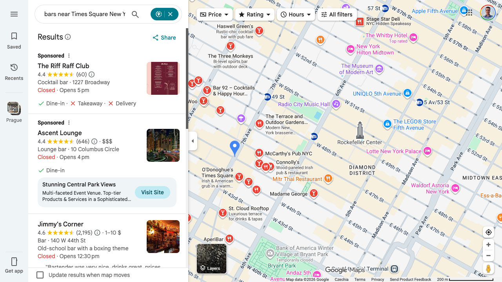

# brow - agentic browsing

Standalone Playwright CLI for agent browser automation. Launches a real Chromium instance with an agent-friendly API - structured commands for common actions, eval escape hatch for full power.

## Install

**Homebrew:**
```bash
brew tap detrin/tap
brew install brow
```

**pip:**
```bash
pip install brow-cli
playwright install chromium
```

**Agent skill:**
```bash
# For most agents (Cline, Cursor, Amp, Gemini CLI, etc.)
npx -y skills add detrin/brow

# For OpenCode (manual install)
git clone https://github.com/detrin/brow.git
ln -s "$(pwd)/brow/skills/brow" ~/.opencode/skills/brow   # OpenCode
```

## Example: Find Bars Near Times Square with Google Maps

A real use case: use your Google account to search Maps in a city you've never visited, and extract structured results.

### Step 1: Log into Google (once)

Open a headed browser with a persistent profile and sign in manually:

```bash
brow session new --profile personal --headed
brow navigate -s 1 "https://accounts.google.com"
# Sign in manually in the browser window...
brow session delete 1
```

Your login is saved in `~/.brow/profiles/personal/` -you won't need to sign in again.

### Step 2: Ask Claude Code to search

Paste this into Claude Code:

> Open a brow session with my personal profile, go to Google Maps, and search for
> bars near Times Square in New York. Return the names, Google Maps URLs, ratings,
> and number of reviews in a markdown table.

Claude Code runs:

```bash
brow session new --profile personal --headed    # → 1 (already logged in)
brow navigate -s 1 "https://www.google.com/maps/search/bars+near+Times+Square+New+York"
brow screenshot -s 1
brow eval -s 1 "
results = await page.evaluate('''() => {
    const items = document.querySelectorAll('div.Nv2PK');
    return Array.from(items).slice(0, 8).map(el => {
        const name = el.querySelector('.fontHeadlineSmall, .qBF1Pd');
        const rating = el.querySelector('.MW4etd');
        const reviews = el.querySelector('.UY7F9');
        const link = el.querySelector('a[href*=\"/maps/place\"]');
        return {
            name: name?.innerText || '',
            rating: rating?.innerText || '',
            reviews: reviews?.innerText.replace(/[()]/g, '') || '',
            url: link?.href || ''
        };
    });
}''')
import json
result = json.dumps(results, indent=2)
"
brow session delete 1
```

### Result



| Bar | Rating | Reviews | Link |
|-----|--------|---------|------|
| The Riff Raff Club | 4.4 | 60 | [Maps](https://www.google.com/maps/place/The+Riff+Raff+Club/) |
| Ascent Lounge | 4.4 | 646 | [Maps](https://www.google.com/maps/place/Ascent+Lounge/) |
| Jimmy's Corner | 4.6 | 2,195 | [Maps](https://www.google.com/maps/place/Jimmy's+Corner/) |
| O'Donoghue's Times Square | 4.4 | 2,633 | [Maps](https://www.google.com/maps/place/O'Donoghue's+Times+Square/) |
| The Dickens | 4.8 | 2,128 | [Maps](https://www.google.com/maps/place/The+Dickens/) |
| The Woo Woo | 4.8 | 1,871 | [Maps](https://www.google.com/maps/place/The+Woo+Woo/) |

Because the `google` profile persists your login, you get personalized results -no cookie banners, no sign-in walls, just data.

## Benchmarks

Compared against **playwright-cli** (Playwright MCP's CLI mode) and **MCP Playwright** (SSE server) on 16 browser automation tasks using Claude Sonnet as the agent. All tasks use local fixture pages for reproducibility.

| Metric | **brow** | playwright-cli | MCP Playwright |
|--------|----------|---------------|----------------|
| Avg tokens/task | **86K** | 113K | 118K |
| Success rate | **69%** | 44% | 38% |
| Avg wall-clock | **33s** | 44s | 50s |
| Est. cost/task | **$0.27** | $0.35 | $0.37 |

brow uses **24% fewer tokens**, succeeds on **25% more tasks**, and runs **25% faster** than the next-best backend.

Key optimizations: ref-based element addressing (`[N]` refs instead of CSS selectors), auto-snapshot after mutations (fewer tool calls), table-aware markdown output, inline list compression, and adaptive node caps.

Full results and methodology: [benchmarks/README.md](benchmarks/README.md)

## Commands

### Daemon

```bash
brow daemon start [--port 19987]
brow daemon stop
brow daemon status
```

### Sessions

```bash
brow session new [--profile <name>] [--headed]
brow session list
brow session delete <id>
```

### Navigation

```bash
brow -s <id> navigate <url>
brow -s <id> wait <selector>
brow -s <id> wait --load
```

### Observation

```bash
brow -s <id> snapshot [--search <regex>] [--locator <selector>]
brow -s <id> screenshot [--full] [--path <file>]
brow -s <id> html [--locator <selector>] [--search <regex>]
brow -s <id> logs [--search <regex>] [--count <n>]
brow -s <id> url
```

### Interaction

```bash
brow -s <id> click <selector>
brow -s <id> fill <selector> <value>
brow -s <id> type <text>
brow -s <id> key <key>            # Enter, Tab, Meta+a
brow -s <id> hover <selector>
brow -s <id> scroll <pixels>
brow -s <id> scroll-to <selector>
brow -s <id> drag <from> <to>
brow -s <id> upload <selector> <filepath>
```

### Pages

```bash
brow -s <id> page list
brow -s <id> page new [url]
brow -s <id> page close [index]
brow -s <id> page switch <index>
```

### Profiles & State

```bash
brow profile list
brow profile delete <name>
brow state save <name> -s <id>
brow state restore <name> -s <id>
brow state list
```

### Eval

```bash
brow -s <id> eval <code>
```

Variables available in eval: `page`, `context`, `browser`, `state`, `pages`.

## Selectors

Playwright selector syntax:
- CSS: `button.submit`, `#login`
- Text: `text=Login`
- Role: `role=button[name="Save"]`
- XPath: `xpath=//div`

## Architecture

```
  ┌─────────────────────────────────────────────────────────────────┐
  │  Agent (Claude Code, script, etc.)                              │
  │                                                                 │
  │  brow session new --headed          ← start browser             │
  │  brow navigate -s 1 "https://..."   ← go to page               │
  │  brow snapshot -s 1                 ← read page (a11y tree)     │
  │  brow click -s 1 "text=Login"       ← interact                  │
  │  brow fill -s 1 "#email" "me@..."   ← fill form                 │
  │  brow screenshot -s 1               ← capture screen            │
  │  brow eval -s 1 "await page..."     ← escape hatch              │
  │  brow session delete 1              ← cleanup                   │
  └──────────────┬──────────────────────────────────────────────────┘
                 │ HTTP (localhost:19987)
                 ▼
  ┌──────────────────────────────────────┐
  │  brow daemon (FastAPI + uvicorn)     │
  │                                      │
  │  ┌──────────┐  ┌──────────────────┐  │
  │  │ Session 1 │  │ ProfileManager   │  │
  │  │ (browser) │  │ ~/.brow/profiles │  │
  │  ├──────────┤  └──────────────────┘  │
  │  │ Session 2 │                       │
  │  │ (browser) │  ┌──────────────────┐  │
  │  └──────────┘  │ StateManager     │  │
  │                 │ ~/.brow/states   │  │
  │                 └──────────────────┘  │
  └──────────────┬───────────────────────┘
                 │ CDP (Chrome DevTools Protocol)
                 ▼
  ┌──────────────────────────────────────┐
  │  Chromium (via Playwright)           │
  │                                      │
  │  ┌────────┐ ┌────────┐ ┌────────┐   │
  │  │ Page 1 │ │ Page 2 │ │ Page 3 │   │
  │  └────────┘ └────────┘ └────────┘   │
  └──────────────────────────────────────┘
```

- Daemon auto-starts on first `brow` command
- Persistent Chromium profiles for login session survival
- One browser per session, full isolation
- Headless by default, `--headed` to watch

## Configuration

| Variable | Default | Description |
|----------|---------|-------------|
| `BROW_HOME` | `~/.brow` | Data directory |
| `BROW_PORT` | `19987` | Daemon port |
| `BROW_MAX_SESSIONS` | `10` | Max concurrent sessions |

## Resource Usage

~150-300MB per Chromium instance. 10 sessions = ~2-3GB.

## License

MIT
